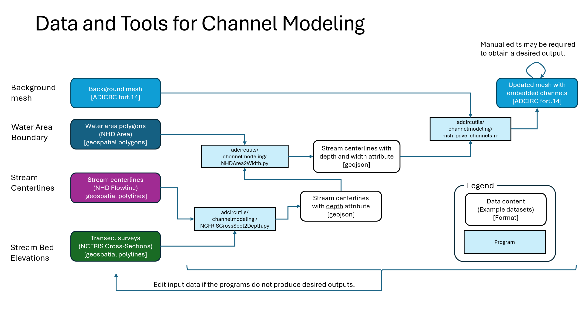

# ADCIRC Utilities

This repository provides a collection of tools for working with ADCIRC meshes and related data. These utilities are designed to simplify and enhance workflows for ADCIRC modelers.

## Tools

### 1. `channelmodeling`
Tools for adding or editing 1D/2D channels in an ADCIRC mesh. Features include:
- Extracting channel widths and depths along stream centerlines.
- Generating a channel mesh and embedding them into a background mesh.
- Convert between a mesh with channel boundaries (vertical element walls) and a mesh without channel boundaries, accompanied by auxiliary data that specifies channel boundary locations and attributes. 

### 2. `dem2adcdp`
Extract depths at nodes in an ADCIRC mesh from a provided Digital Elevation Model (DEM) file. Key functionalities:
- Compute mean, maximum, or minimum values in the DEM around a node.
- Specify minimum or maximum depths.
- Update nodes selectively using polygons.

### 3. `hydrologyboundary`
Generates the flow boundary condition file (`fort.20`) for flow boundaries defined in a mesh file (`fort.14`). Features include:
- Extracting discharge data from USGS stations or NOAA National Water Model historical datasets.

### 4. `nodalattr`
Creates nodal attribute values. Key functionality:
- Calculates Manning's n nodal attribute values from landuse data
  - Map landuse categories to Manning's n values.
  - Assign calculated values to nodes in an ADCIRC mesh.
  - Support for various landuse data formats.

### 5. `plot`
Provides plotting tools for ADCIRC simulation results. Key functionalities:
- Plot hydrographs from simulation results and observations. Observed water levels are downloaded from either NOAA or USGS data repository.
- Plot error histograms at stations.

### 6. `postprocess`
Provides postprocessing tools for ADCIRC simulation results. Key functionality:
- Compute differences in maxele.63.nc files from different simulations.
- Compute disturbance values.

## Getting Started

To use these tools, clone the repository and install it by executing `install.sh`. The install script, `install.sh` is configured not to install dependent modules by `pip install` to avoid causing issues in conda environments. You may need to identify and install dependencies as `pyproject.toml` does not list all of dependent packages at the moment.

```bash
git clone https://github.com/shinbunya/adcircutils.git
cd adcircutils
bash install.sh
```

## Links to Examples
### [Channel Mesh Paving (examples/channelmodeling/channelpaving/example1/)](examples/channelmodeling/channelpaving/example1/)

This example demonstrates the channel paving process using tools in `adcircutils/channelmodeling`. It provides a sample setup to showcase how to model and pave a channel in a background mesh for ADCIRC simulations. [Go to this example](examples/channelmodeling/channelpaving/example1/)



## License

This project is licensed under the [MIT License](LICENSE).

<!-- ## Contributions

Contributions are welcome! Please submit issues or pull requests to improve the tools. -->

## Contact

For questions or support, please open an issue in the repository or contact sbunya@unc.edu.
